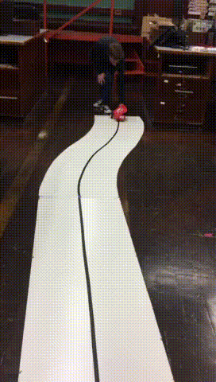

# Line Follower

This code was developer for a line following robot (shown above) as part of [CCSF's engineering club](https://sites.google.com/a/mail.ccsf.edu/ccsf-engineering-club/). It uses Jim Lindbloms excellent [ardumoto code](https://learn.sparkfun.com/tutorials/ardumoto-shield-hookup-guide/example-code).
